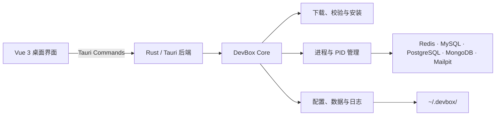

<p align="center">
  
</p>

<h1 align="center">智屿 · Zhiyu Env</h1>

<p align="center">
  <strong>轻量本地开发环境管理工具</strong><br>
  不用 Docker，不用虚拟机，不污染系统环境。
</p>

<p align="center">
  <a href="README.md">简体中文</a> ·
  <a href="README_EN.md">English</a>
</p>

<p align="center">
  
  
  
  
  
  
</p>

## 智屿是什么？

智屿是一个面向个人开发者的桌面端本地开发环境管理工具。

它不创建容器或虚拟机，而是将 Redis、MySQL、PostgreSQL 等服务安装到当前用户目录，通过 Rust 直接管理服务进程。你可以在一个轻量桌面应用中完成安装、启动、停止、配置、日志查看、资源监控和本地数据调试。

智屿专注于“快速拥有一个能用的本地服务”，不处理生产环境部署、集群编排和高可用。

## 为什么选择智屿？

- **没有 Docker Runtime**：不需要常驻 Docker Desktop。
- **没有虚拟机**：服务直接作为本机用户进程运行。
- **不污染系统**：不写入 `/usr/local`，不要求全局安装数据库。
- **按版本隔离**：程序安装在独立的版本目录中。
- **开箱即用**：自动下载官方发行包或源码包，并校验 SHA-256。
- **轻量可见**：实时查看 CPU、内存、运行时间和磁盘占用。
- **开发工具内置**：直接浏览数据、执行受限命令和检查端口。

## 已支持的服务

| 服务 | 当前版本 | 默认端口 | 内置开发能力 |
| --- | ---: | ---: | --- |
| Redis | 5.0 / 6.0 / 6.2 / 7.0 / 7.2 / 7.4 | 6379 | 多版本切换、Key 浏览、类型与 TTL 查看、命令台 |
| MySQL | 8.0 / 8.4 / 9.7 | 3306 | 版本切换、数据库与表浏览、字段说明、SQL 命令台 |
| PostgreSQL | 14 / 15 / 16 / 17 / 18 | 5432 | 版本切换、Schema 与表浏览、字段说明、SQL 命令台 |
| MongoDB | 8.0.26 | 27017 | 数据库与集合浏览、字段识别、JSON 命令台 |
| Mailpit | 1.30.5 | 1025 / 8025 | 本地邮件捕获、邮件列表与正文查看 |
| NATS | 2.14.2 | 4222 / 8222 | JetStream、实时指标、消息发布与单次订阅 |
| Meilisearch | 1.50.0 | 7700 | 索引监控、JSON 文档导入、全文搜索调试 |
| MinIO | RELEASE.2025-09-07 | 9000 / 9001 | S3 API、Web Console、存量项目兼容调试 |
| RustFS | 1.0.0-beta.2 | 9002 / 7001 | S3 API、Web Console、Rust 对象存储开发调试 |
| etcd | 3.6.11 | 2379 / 2380 | 单节点服务协调、配置读取、内置 etcdctl |
| Consul | 1.22.3 | 8500 / 8600 | 服务发现、健康检查、KV、官方 Web UI |
| rnacos | 0.8.5 | 8848 / 9848 / 10848 | Nacos 兼容配置与服务发现、无需 Java |
| RabbitMQ | 4.3.1 | 5672 / 15672 | AMQP、Management UI、内置独立 Erlang/OTP 27 |

所有服务均支持：

- 自动安装
- 安装阶段进度、可折叠日志预览与失败详情
- 启动、停止和重启
- PID 与运行状态检测
- 配置文件编辑
- 运行日志查看
- CPU、内存和运行时间监控
- 程序、数据、日志、配置及下载缓存的磁盘占用统计
- 按服务清理下载包与安装临时缓存
- 数据与配置的本地备份、安全恢复

Redis、MySQL 和 PostgreSQL 均提供独立的“版本管理”页面。不同版本的程序与数据可同时存在，停止服务后即可切换活动版本；PostgreSQL 各主版本通过独立 `initdb` 数据目录隔离。

统一设置中心支持 macOS 登录启动、退出时服务保留策略、下载镜像与并发、安装目录、日志和备份保留、更新检查，以及一键清理全部安装缓存。

此外，智屿提供无需常驻进程的轻量工具：

- **TCP 端口检查器**：识别本机监听端口及其所属进程。
- **DuckDB 本地文件查询器**：用只读 SQL 查询 CSV、TSV、JSON、JSONL、Parquet 和 `.duckdb` 文件。
- **SQLite 本地数据库**：创建、打开和查询 `.sqlite`、`.sqlite3` 与 `.db` 文件，内嵌引擎且无需启动服务。

## 界面能力

### 服务概览

每个服务都有独立的详情页面，可查看运行状态、PID、本地端点、实时资源曲线、磁盘占用和文件路径。

### 数据调试

- Redis：扫描 Key、查看值、类型、TTL 和内存大小。
- MySQL / PostgreSQL：浏览数据库、数据表、字段结构和前 100 行数据。
- MongoDB：浏览数据库、集合、推断字段类型并预览文档。
- DuckDB：把本地数据文件映射为 `selected_file`，直接执行筛选、聚合和字段检查。
- 数据库类型旁提供中文解释角标。

### 安全命令台

智屿内置 Redis、SQL 和 MongoDB 命令台。阻塞服务或明显危险的管理命令会被禁止，清空或删除数据的命令需要二次确认。

### 本地邮件沙箱

Mailpit 只监听 `127.0.0.1`，不会将邮件投递到外部服务器：

```text
SMTP_HOST=127.0.0.1
SMTP_PORT=1025
SMTP_AUTH=false
SMTP_TLS=false
```

Web/API 地址为 `http://127.0.0.1:8025`。智屿中的邮件 HTML 以源码文本显示，不会直接执行邮件内的脚本或加载远程样式。

## 工作原理



智屿不会修改系统 PATH。所有运行参数、PID、配置、数据和日志都保存在用户目录。

## 数据目录

```text
~/.devbox/
├── downloads/                 # 已校验的安装包缓存
├── installations/             # 按服务和版本隔离的程序
│   ├── redis/
│   │   ├── 5.0/
│   │   ├── 6.0/
│   │   ├── 6.2/
│   │   ├── 7.0/
│   │   ├── 7.2/
│   │   └── 7.4/
│   ├── mysql/8.4/
│   ├── postgres/17/
│   ├── mongodb/8.0/
│   ├── mailpit/1.30/
│   └── duckdb/1.5/
├── instances/                 # 当前服务实例
│   └── <service>/default/
│       ├── conf/
│       ├── data/
│       ├── logs/
│       ├── run/
│       └── service.json
├── backups/                   # 按服务保存的数据与配置备份
└── tmp/                       # 安装过程临时文件
```

## 当前平台支持

当前版本优先支持：

- macOS
- Apple Silicon（ARM64）

项目仍处于 Alpha 阶段。安装器中的发行包、校验值和构建流程目前都针对 Apple Silicon 验证，尚不建议在日常重要数据或生产环境中使用。

## 本地开发

### 环境要求

- macOS Apple Silicon
- Rust stable
- Node.js 20.19+ 或兼容 Vite 7 的更新版本
- npm
- Xcode Command Line Tools

### 启动桌面端

```bash
npm install
npm run tauri dev
```

### 构建

```bash
npm run tauri build
```

### 测试

```bash
cargo test --workspace
npm run build
```

部分真实服务集成测试默认标记为 `ignored`，避免自动修改或启动本机服务。

## 项目结构

```text
zhiyu-env/
├── crates/devbox-core/        # 服务抽象、安装器、进程与配置管理
├── src-tauri/                 # Tauri Commands 与数据库工具接口
├── src/                       # Vue 3 + TypeScript 桌面界面
├── assets/                    # 项目资源
├── Cargo.toml                 # Rust workspace
└── package.json               # 前端与 Tauri 脚本
```

核心服务统一实现 `ServiceManager`：

```text
install · start · stop · restart · status
```

## 下载镜像

智屿会按“自定义镜像 → GitHub 公共加速 → 官方源”的顺序下载安装包。某个下载源连接失败、速度持续过慢或 SHA-256 校验不一致时，会自动切换到下一个来源。

如需使用自己的国内对象存储或 CDN，可将安装包按原始文件名上传到同一目录，然后在 `~/.devbox/download-mirror.txt` 中写入该目录的 HTTPS 地址：

```text
https://your-cdn.example.com/zhiyu-packages
```

也可以通过 `ZHIYU_DOWNLOAD_MIRROR` 环境变量临时覆盖这个地址。公共加速服务是第三方服务；如不希望使用，可设置 `ZHIYU_DISABLE_PUBLIC_MIRROR=1`，此时仍会在自定义镜像失败后回退官方源。无论使用哪个来源，安装包都必须通过项目预置的 SHA-256 校验。

## 安全边界

- 下载内容必须通过预置 SHA-256 校验。
- 服务默认仅用于本地开发，不提供生产级安全加固。
- Mailpit 强制使用本地监听，不启用 SMTP 中继或转发。
- 配置文件保存前会生成 `.bak` 备份。
- 数据恢复前会自动创建当前状态的安全备份。
- 备份压缩包恢复前会检查路径、链接和特殊文件。
- 邮件 HTML 不直接渲染。
- 数据命令台对阻塞命令和破坏性命令进行限制。
- DuckDB 文件查询只接受查询类 SQL；数据库文件以 `safe + readonly` 模式打开，查询限制为 15 秒和最多展示 500 行。
- Redis 切换版本前必须停止服务。不同版本共用基础配置，但数据按版本保存在独立目录中；切换前仍建议创建备份。
- MySQL 支持 8.0、8.4 和 9.7 独立安装与切换。不同版本使用独立数据目录，新版本首次切换时会初始化空数据库。
- PostgreSQL 支持 14 至 18 的当前维护版本。不同主版本使用独立数据目录，不会直接复用不兼容的数据文件。

> 智屿不是容器隔离方案。服务进程仍然以当前用户权限直接运行在 macOS 上。

## 路线图

- Redis 多实例管理
- 备份保留策略与定时备份
- Linux 与 Intel Mac 支持
- 更多轻量开发工具

## 参与贡献

欢迎提交 Issue 和 Pull Request。建议一次只处理一个清晰模块，并同时提供：

- 修改内容
- 设计原因
- 测试方式

提交代码前请运行：

```bash
cargo fmt --all
cargo test --workspace
npm run build
```

## 许可证

本项目根据 [Apache License 2.0](LICENSE) 开源。
