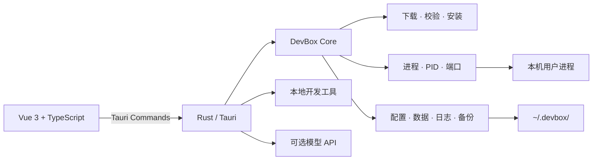

<p align="center">
  
</p>

<h1 align="center">智屿 · Zhiyu Env</h1>

<p align="center">
  <strong>轻量、本地优先的一站式开发环境与工具箱</strong><br>
  不用 Docker，不用虚拟机，不依赖系统全局安装。
</p>

<p align="center">
  <a href="README.md">简体中文</a> ·
  <a href="README_EN.md">English</a>
</p>

<p align="center">
  
  
  
  
  
  
</p>

## 智屿是什么？

智屿是一款面向个人开发者的桌面端本地开发工具。

它把 Redis、MySQL、PostgreSQL、Nginx 等官方程序安装到用户目录，由 Rust 直接管理进程、版本、配置、日志和数据。除服务管理外，智屿还提供语言环境、数据库浏览、Mock API、HTTP/SSH/S3 调试、RSS 阅读和可选 AI 助手。

智屿追求的是“快速得到一个能用、好管理的本地开发环境”，不处理生产部署、容器隔离、集群编排或高可用。

## 核心特点

- **原生轻量**：没有 Docker Runtime，也不启动虚拟机。
- **不污染系统**：程序、配置、数据、日志和缓存默认放在 `~/.devbox/`。
- **多版本并存**：不同版本使用独立程序和数据目录，停止后即可切换。
- **生命周期完整**：安装、取消、启动、停止、重启、状态恢复和安全卸载。
- **安装更可靠**：镜像回退、断点续传、SHA-256 校验、缓存复用和失败清理。
- **状态可观测**：全局 CPU、内存、磁盘、端口、异常服务和活动记录。
- **本地工具齐全**：常见开发调试无需再安装多个独立桌面应用。
- **可选 AI**：使用你自己的模型 API，AI 不会绕过智屿直接执行命令。
- **界面可定制**：中英文、明暗模式、15 套配色、10 种纹理、背景图和字号缩放。

## 服务与中间件

| 分类 | 服务 | 内置能力 |
| --- | --- | --- |
| 数据库 | Redis、MySQL、PostgreSQL、MongoDB | 版本管理、数据浏览、字段说明、受限命令台、备份恢复 |
| 对象存储 | MinIO、RustFS | S3 API、Web Console、连接配置 |
| 消息系统 | NATS、RabbitMQ、ActiveMQ Classic、Kafka Sandbox、ZeroMQ | 消息发布/订阅、主题与队列调试、运行指标 |
| 服务治理 | etcd、Consul、rnacos | 本地单节点、KV/服务发现、官方或兼容客户端 |
| 搜索 | Meilisearch | 索引概览、JSON 文档导入、全文搜索 |
| Web | Nginx、Caddy | 站点文件、配置、日志和本地端点 |
| 邮件 | Mailpit | 本地 SMTP 捕获、邮件列表与安全正文预览 |

所有托管服务共享以下能力：

- 自动安装、安装进度与可折叠日志
- 下载取消、失败重试和缓存复用
- 启动、停止、重启和一键停止全部
- 防止重复启动、PID 复用校验和端口就绪等待
- 崩溃检测、过期 PID 清理、一键诊断与状态修复
- CPU、内存、运行时间和分类磁盘占用
- 配置编辑、运行日志、备份恢复和安全卸载
- 已验证版本列表、兼容性提示和版本目录隔离

Redis 支持 5.0、6.0、6.2、7.0、7.2、7.4；MySQL 支持 8.0、8.4、9.7；PostgreSQL 支持 14 至 18。其他服务也提供多个经过项目登记和校验的版本，具体以应用内“版本管理”页面为准。

## 语言开发环境

智屿目前可独立管理：

- Go
- Java（包含 Java 8 及多个现代 LTS 版本）
- Rust
- Python
- Node.js

每个运行时提供版本选择、下载安装、切换、环境变量预览和卸载。运行时保存在智屿目录中，不修改系统全局 `PATH`。

## 内置开发工具

| 工具 | 用途 |
| --- | --- |
| 端口检查器 | 查看本机 TCP 监听地址、进程和 PID |
| 本地 Mock API | 创建多条 HTTP Mock 路由、状态码、延迟和响应 |
| HTTP 请求调试器 | Header、Body、重定向、响应和 cURL |
| WebSocket / SSE | 调试实时连接和消息 |
| SSH 连接管理 | 本地连接配置、主机指纹校验和交互终端 |
| S3 浏览器 | AWS S3、Cloudflare R2、阿里云 OSS、腾讯云 COS、七牛云、MinIO、RustFS |
| RSS 订阅 | RSS / Atom / JSON Feed、本地阅读、OPML 和可选推荐源 |
| DuckDB 查询器 | 查询 CSV、TSV、JSON、JSONL、Parquet 和 DuckDB 文件 |
| SQLite 数据库 | 创建、打开和查询本地 SQLite 文件 |
| 剪贴板历史 | 本地 SQLite 历史、搜索、置顶和快速复制 |
| 数据格式工具箱 | JSON、YAML、TOML、CSV、编码与文本转换 |
| JWT 调试器 | 解码、校验和本地签发 |
| 时间与时间戳 | Unix 时间戳、日期时间和时区转换 |
| 正则表达式调试器 | 实时匹配、捕获组和替换预览 |
| Cron 表达式 | 5 段 Cron 校验、解释和未来运行时间 |
| QR Code | 本地生成、识别和导出二维码 |

工具与服务可以在设置中心隐藏、显示并拖动排序。

## AI 能力

AI 是可选能力。智屿不内置付费模型，用户可配置自己的 API：

- OpenAI Compatible
- Anthropic Compatible
- 内置 DeepSeek、OpenAI、Anthropic、通义千问等服务商预设
- 自定义 Base URL 和模型 ID
- 流式输出和本地聊天记录

当前 AI 场景包括：

- RSS 文章总结、翻译、关键要点和基于文章问答
- MySQL / PostgreSQL SQL 生成、错误解释和 `EXPLAIN` 分析
- Redis 命令生成、Key/TTL/内存与慢查询分析
- 服务日志诊断
- Nginx / Caddy 配置建议
- HTTP 请求、Cron 和正则表达式生成
- SSH 命令建议

模型只生成建议。SQL、Redis、HTTP、配置、Cron 和正则结果最多写入相应编辑器，仍需用户确认；SSH 和日志建议不会自动执行。Redis 高风险命令会被额外拦截。

> 使用 AI 时，当前问题及必要上下文会发送到你配置的模型服务商。API 配置和聊天记录保存在本地。

## 全局管理与桌面体验

- 全局概览：运行服务数、CPU、内存、磁盘、端口、状态和磁盘排行榜
- 异常提醒：仅在发现崩溃、陈旧 PID 或其他异常时显示
- 一键诊断与修复
- 安装缓存清理、备份保留和日志保留策略
- macOS 菜单栏与 Windows 系统托盘交互
- 关闭窗口后按设置决定是否继续保留服务
- 新手引导、设置分组和自动保存
- 中英文界面
- 服务和工具显示开关及拖动排序
- 主题、纹理、自定义背景图、模糊效果和 UI 缩放

## 工作原理



智屿不会创建容器，也不会修改系统 `PATH`。托管服务仍以当前用户权限直接运行在本机。

## 数据目录

```text
~/.devbox/
├── downloads/                 # 已校验安装包缓存与断点文件
├── installations/             # 按组件和版本隔离的程序
│   └── <component>/<version>/
├── instances/                 # 当前服务实例
│   └── <service>/default/
│       ├── conf/
│       ├── data/
│       ├── logs/
│       ├── run/
│       └── service.json
├── runtimes/                  # 语言运行时
├── backups/                   # 数据和配置备份
└── tmp/                       # 安装阶段临时目录
```

部分桌面工具的数据（如 RSS、AI 会话和剪贴板）保存在操作系统的应用数据目录中。

## 平台支持

当前优先支持并验证：

- macOS
- Apple Silicon（ARM64）

项目仍处于 Alpha 阶段。部分代码已考虑 Intel Mac 和 Windows 的平台差异，但服务安装包与完整流程目前以 macOS Apple Silicon 为主要验收目标。

## 本地开发

### 环境要求

- macOS Apple Silicon
- Rust stable
- Node.js 20.19+ 或兼容 Vite 7 的更新版本
- npm
- Xcode Command Line Tools

### 启动

```bash
npm install
npm run tauri dev
```

### 构建

```bash
npm run tauri build
```

### 测试

```bash
cargo fmt --all -- --check
cargo test --workspace
npm run build
```

部分真实服务集成测试默认标记为 `ignored`，避免常规测试修改或启动本机服务。

## 项目结构

```text
zhiyu-env/
├── crates/devbox-core/        # 服务抽象、安装器、进程与配置管理
├── src-tauri/                 # Tauri Commands 与本地工具后端
├── src/                       # Vue 3 + TypeScript 桌面界面
├── assets/                    # 图标与项目资源
├── Cargo.toml                 # Rust workspace
└── package.json               # 前端与 Tauri 脚本
```

核心服务统一实现：

```text
install · start · stop · restart · status
```

## 下载与安装

智屿按“自定义镜像 → 公共 GitHub 加速 → 官方源”的顺序尝试下载，并支持：

- 断点续传
- 下载超时和低速回退
- SHA-256 校验
- 已验证缓存复用
- 取消安装
- 失败后清理半成品目录
- Apple Silicon、Intel Mac 和 Windows 架构识别

自定义镜像可直接在设置中心配置。无论使用哪个来源，安装包都必须通过项目登记的 SHA-256 校验。

## 安全边界

- 智屿面向本地开发，不提供容器级隔离或生产安全加固。
- 服务默认绑定本地开发端口；不要将开发账号或管理端口暴露到公网。
- 下载内容必须通过预置 SHA-256 校验。
- 配置保存和数据恢复前会创建备份。
- 备份恢复会检查路径穿越、链接和特殊文件。
- SQL、Redis、MongoDB、DuckDB 等命令台限制危险或阻塞操作。
- SSH 使用独立 `known_hosts` 校验主机指纹；密码仅用于当前会话。
- 邮件 HTML、RSS 正文和 AI Markdown 不直接执行不可信 HTML。
- AI 不直接执行生成的命令；发送给第三方模型的内容受对应服务商政策约束。
- 本地保存的连接配置和 API Key 属于敏感数据，请保护好当前系统用户账户及应用数据目录。

## 路线图

- 完善 Intel Mac 与 Windows 安装器验证
- 服务多实例和端口模板
- 定时备份与更细粒度保留策略
- 更完善的 AI 结构化生成与操作预览
- 更多轻量语言环境和开发工具

## 参与贡献

欢迎提交 Issue 和 Pull Request。建议一次只处理一个清晰模块，并说明：

- 修改了什么
- 为什么这样设计
- 如何测试

提交前请运行：

```bash
cargo fmt --all
cargo test --workspace
npm run build
```

## 许可证

本项目根据 [Apache License 2.0](LICENSE) 开源。
