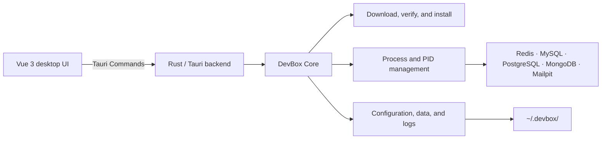

<p align="center">
  
</p>

<h1 align="center">Zhiyu Env</h1>

<p align="center">
  <strong>A lightweight local development environment manager</strong><br>
  No Docker, no virtual machine, and no system-wide database installation.
</p>

<p align="center">
  <a href="README.md">简体中文</a> ·
  <a href="README_EN.md">English</a>
</p>

<p align="center">
  
  
  
  
  
  
</p>

## What is Zhiyu?

Zhiyu is a desktop application that manages local development services for individual developers.

Instead of creating containers or virtual machines, Zhiyu installs Redis, MySQL, PostgreSQL, and other services inside the current user's home directory and manages their processes directly with Rust. Installation, lifecycle controls, configuration, logs, resource monitoring, and local data inspection are available from one lightweight desktop UI.

Zhiyu focuses on making a usable local service available quickly. It is not designed for production deployment, cluster orchestration, or high availability.

## Why Zhiyu?

- **No Docker runtime** — Docker Desktop does not need to stay running.
- **No virtual machine** — services run as native user processes.
- **No system pollution** — nothing is installed into `/usr/local`.
- **Versioned layout** — service programs live in isolated version directories.
- **Automatic setup** — official distributions or source archives are downloaded and verified with SHA-256.
- **Visible and lightweight** — monitor CPU, memory, uptime, and disk usage.
- **Built-in developer tools** — inspect data, run guarded commands, and check local ports.

## Supported services

| Service | Current version | Default port | Built-in developer tools |
| --- | ---: | ---: | --- |
| Redis | 5.0 / 6.0 / 6.2 / 7.0 / 7.2 / 7.4 | 6379 | Version switching, key browser, type and TTL inspection, command console |
| MySQL | 8.0 / 8.4 / 9.7 | 3306 | Version switching, database and table browser, column help, SQL console |
| PostgreSQL | 14 / 15 / 16 / 17 / 18 | 5432 | Version switching, schema and table browser, column help, SQL console |
| MongoDB | 8.0.26 | 27017 | Database and collection browser, field inference, JSON console |
| Mailpit | 1.30.5 | 1025 / 8025 | Local email capture, message list, and body viewer |
| NATS | 2.14.2 | 4222 / 8222 | JetStream, live metrics, publish, and one-message subscriptions |
| Meilisearch | 1.50.0 | 7700 | Index metrics, JSON document import, and full-text search |

Every service supports:

- Automatic installation
- Installation progress, collapsible log preview, and failure details
- Start, stop, and restart
- PID and runtime status detection
- Configuration editing
- Runtime log viewing
- CPU, memory, and uptime monitoring
- Disk usage for programs, data, logs, configuration, and download caches
- Per-service cleanup for downloads and temporary installation files
- Local backup and guarded restore for data and configuration

Redis, MySQL, and PostgreSQL include a dedicated Version Manager page. Binaries and data for different versions can coexist, and the active version can be changed while the service is stopped. PostgreSQL major versions use separate `initdb` data directories.

Zhiyu also includes lightweight tools with no resident process:

- **TCP port checker** — identifies listening ports and their owning processes.
- **DuckDB local file query tool** — runs read-only SQL against CSV, TSV, JSON, JSONL, Parquet, and `.duckdb` files.
- **SQLite local database tool** — creates, opens, and queries `.sqlite`, `.sqlite3`, and `.db` files with an embedded engine.

## Desktop features

### Service overview

Each service has its own detail page with runtime status, PID, local endpoint, live resource charts, disk usage, and file locations.

### Data inspection

- Redis: scan keys and inspect values, types, TTLs, and memory size.
- MySQL / PostgreSQL: browse databases, tables, column definitions, and the first 100 rows.
- MongoDB: browse databases and collections, infer field types, and preview documents.
- DuckDB: map a selected local file to `selected_file` for filtering, aggregation, and schema inspection.
- Database types include compact Chinese help tooltips in the current UI.

### Guarded consoles

Zhiyu provides Redis, SQL, and MongoDB consoles. Blocking or unsafe administrative commands are rejected, while destructive data operations require explicit confirmation.

### Local email sandbox

Mailpit is restricted to `127.0.0.1` and never relays messages to an external mail server:

```text
SMTP_HOST=127.0.0.1
SMTP_PORT=1025
SMTP_AUTH=false
SMTP_TLS=false
```

The Web/API endpoint is `http://127.0.0.1:8025`. Email HTML is displayed as escaped source text inside Zhiyu, so scripts and remote styles are not executed.

## How it works



Zhiyu does not modify the system `PATH`. Runtime arguments, PID files, configuration, data, and logs stay under the user's home directory.

## Data layout

```text
~/.devbox/
├── downloads/                 # Verified archive cache
├── installations/             # Programs isolated by service and version
│   ├── redis/
│   │   ├── 5.0/
│   │   ├── 6.0/
│   │   ├── 6.2/
│   │   ├── 7.0/
│   │   ├── 7.2/
│   │   └── 7.4/
│   ├── mysql/8.4/
│   ├── postgres/17/
│   ├── mongodb/8.0/
│   ├── mailpit/1.30/
│   └── duckdb/1.5/
├── instances/                 # Current service instances
│   └── <service>/default/
│       ├── conf/
│       ├── data/
│       ├── logs/
│       ├── run/
│       └── service.json
├── backups/                   # Data and configuration backups by service
└── tmp/                       # Temporary installation files
```

## Platform support

The current release targets:

- macOS
- Apple Silicon (ARM64)

Zhiyu is currently alpha software. Installer archives, checksums, and build flows have been validated for Apple Silicon only. Do not use it for production workloads or as the only copy of important data.

## Local development

### Requirements

- macOS on Apple Silicon
- Stable Rust
- Node.js 20.19+ or another version supported by Vite 7
- npm
- Xcode Command Line Tools

### Run the desktop app

```bash
npm install
npm run tauri dev
```

### Build

```bash
npm run tauri build
```

### Test

```bash
cargo test --workspace
npm run build
```

Some live service integration tests are marked as `ignored` by default so regular test runs do not modify or start local services.

## Repository structure

```text
zhiyu-env/
├── crates/devbox-core/        # Service abstraction, installers, process and config management
├── src-tauri/                 # Tauri commands and database tool adapters
├── src/                       # Vue 3 + TypeScript desktop UI
├── assets/                    # Project assets
├── Cargo.toml                 # Rust workspace
└── package.json               # Frontend and Tauri scripts
```

Every core service implements the same `ServiceManager` lifecycle:

```text
install · start · stop · restart · status
```

## Security boundaries

- Downloads must match a predefined SHA-256 checksum.
- Services are intended for local development and are not production-hardened.
- Mailpit is restricted to loopback interfaces, with SMTP relay and forwarding disabled.
- A `.bak` file is created before configuration changes are saved.
- The current state is backed up automatically before a data restore.
- Backup paths, links, and special files are validated before extraction.
- Email HTML is never rendered directly.
- Data consoles restrict blocking and destructive commands.
- DuckDB only accepts query statements; database files open in `safe + readonly` mode, with a 15-second timeout and a 500-row display cap.
- Redis must be stopped before switching versions. Versions share the base configuration but keep data in separate version directories; creating a backup before switching is still recommended.
- MySQL 8.0, 8.4, and 9.7 can be installed and switched independently. Each version has its own data directory, and a new empty database is initialized on first use.
- PostgreSQL supports the current releases of major versions 14 through 18. Each major version uses a separate data directory instead of reusing incompatible database files.

> Zhiyu is not a container isolation mechanism. Managed services run directly on macOS with the current user's permissions.

## Roadmap

- Redis multi-instance management
- Backup retention policies and scheduled backups
- Linux and Intel Mac support
- More lightweight developer tools

## Contributing

Issues and pull requests are welcome. Please keep each change focused on one clear module and include:

- What changed
- Why it was designed this way
- How it was tested

Before submitting code, run:

```bash
cargo fmt --all
cargo test --workspace
npm run build
```

## License

This project is licensed under the [Apache License 2.0](LICENSE).
