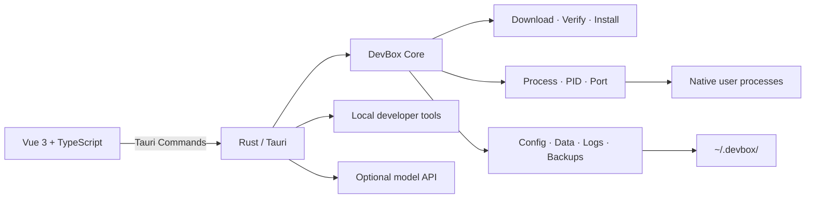

<p align="center">
  
</p>

<h1 align="center">Zhiyu Env</h1>

<p align="center">
  <strong>A lightweight, local-first development environment and toolbox</strong><br>
  No Docker, no virtual machine, and no system-wide runtime installation.
</p>

<p align="center">
  <a href="README.md">简体中文</a> ·
  <a href="README_EN.md">English</a>
</p>

<p align="center">
  
  
  
  
  
  
</p>

## What is Zhiyu?

Zhiyu is a desktop application for individual developers who need local services and everyday development tools.

It installs official Redis, MySQL, PostgreSQL, Nginx, and other programs inside the user's home directory, then manages their processes, versions, configuration, logs, and data directly with Rust. Zhiyu also includes language runtimes, database browsers, a Mock API server, HTTP/SSH/S3 tools, an RSS reader, and an optional AI assistant.

The goal is to make a usable local development environment available quickly. Zhiyu is not a production deployment platform, container isolation layer, cluster orchestrator, or high-availability system.

## Highlights

- **Native and lightweight** — no Docker runtime and no virtual machine.
- **No system pollution** — programs, config, data, logs, and caches stay under `~/.devbox/`.
- **Multiple versions** — versions use isolated program and data directories.
- **Complete lifecycle** — install, cancel, start, stop, restart, recover state, and safely uninstall.
- **Reliable installation** — mirror fallback, resume, SHA-256 verification, cache reuse, and partial-install cleanup.
- **Observable state** — global CPU, memory, disk, ports, failures, and recent activity.
- **Built-in tools** — common development workflows no longer require several separate desktop apps.
- **Optional AI** — use your own model API; generated commands never bypass Zhiyu's controls.
- **Customizable UI** — Chinese and English, light/dark mode, 15 palettes, 10 patterns, background images, and UI scaling.

## Services and middleware

| Category | Services | Built-in capabilities |
| --- | --- | --- |
| Databases | Redis, MySQL, PostgreSQL, MongoDB | Version management, data browser, column help, guarded consoles, backup and restore |
| Object storage | MinIO, RustFS | S3 API, Web Console, and connection configuration |
| Messaging | NATS, RabbitMQ, ActiveMQ Classic, Kafka Sandbox, ZeroMQ | Publish/subscribe, topic and queue debugging, runtime metrics |
| Service coordination | etcd, Consul, rnacos | Local single-node mode, KV/service discovery, official or compatible clients |
| Search | Meilisearch | Index overview, JSON import, and full-text search |
| Web | Nginx, Caddy | Site files, configuration, logs, and local endpoints |
| Email | Mailpit | Local SMTP capture, message list, and safe body preview |

Every managed service shares these capabilities:

- Automatic installation with progress and collapsible logs
- Download cancellation, retry, and cache reuse
- Start, stop, restart, and stop-all
- Duplicate-start prevention, PID reuse validation, and port readiness checks
- Crash detection, stale PID cleanup, diagnostics, and state repair
- CPU, memory, uptime, and categorized disk usage
- Configuration, runtime logs, backup/restore, and safe uninstall
- Verified version lists, compatibility notices, and version isolation

Redis supports 5.0, 6.0, 6.2, 7.0, 7.2, and 7.4. MySQL supports 8.0, 8.4, and 9.7. PostgreSQL supports major versions 14 through 18. Other services also expose multiple releases registered and verified by the project; the in-app Version Manager is the source of truth.

## Language runtimes

Zhiyu currently manages:

- Go
- Java, including Java 8 and modern LTS releases
- Rust
- Python
- Node.js

Each runtime provides version selection, download/install, switching, environment previews, and uninstall. Runtimes stay under Zhiyu's data directory and do not change the global system `PATH`.

## Built-in developer tools

| Tool | Purpose |
| --- | --- |
| Port Inspector | Inspect local TCP addresses, owning processes, and PIDs |
| Local Mock API | Create HTTP mock routes with status codes, delays, and responses |
| HTTP Client | Debug headers, bodies, redirects, responses, and cURL |
| WebSocket / SSE | Test real-time connections and messages |
| SSH Manager | Local connection profiles, host-key validation, and interactive terminal |
| S3 Browser | AWS S3, Cloudflare R2, Alibaba OSS, Tencent COS, Qiniu, MinIO, and RustFS |
| RSS Reader | RSS / Atom / JSON Feed, local reading, OPML, and optional recommendations |
| DuckDB Query | Query CSV, TSV, JSON, JSONL, Parquet, and DuckDB files |
| SQLite Database | Create, open, and query local SQLite files |
| Clipboard History | Local SQLite history, search, pinning, and quick copy |
| Data Format Toolbox | JSON, YAML, TOML, CSV, encodings, and text transforms |
| JWT Debugger | Decode, verify, and locally sign JWTs |
| Time & Timestamp | Unix timestamps, date/time, and time-zone conversion |
| Regex Tester | Live matching, capture groups, and replacement preview |
| Cron Tool | Validate and explain five-field Cron expressions and preview runs |
| QR Code Tool | Generate, scan, and export QR codes locally |

Services and tools can be shown, hidden, and reordered from Settings.

## AI features

AI is optional. Zhiyu does not bundle a paid model; users configure their own API:

- OpenAI Compatible
- Anthropic Compatible
- Presets for DeepSeek, OpenAI, Anthropic, and Qwen
- Custom Base URL and model ID
- Streaming responses and local chat history

Current AI workflows include:

- RSS summaries, translation, key points, and article Q&A
- MySQL/PostgreSQL SQL generation, error explanation, and `EXPLAIN` analysis
- Redis command generation and Key/TTL/memory/slow-query analysis
- Service log diagnosis
- Nginx/Caddy configuration suggestions
- HTTP request, Cron, and regular-expression generation
- SSH command suggestions

The model only generates suggestions. SQL, Redis, HTTP, configuration, Cron, and regex output can at most be placed into the corresponding editor and still requires user action. SSH and log advice is never executed automatically. High-risk Redis commands are additionally blocked.

> AI requests send the current question and required context to the model provider configured by the user. API configuration and chat history are stored locally.

## Global management and desktop experience

- Global overview for running services, CPU, memory, disk, ports, state, and disk ranking
- Failure alerts shown only when an abnormal service is detected
- One-click diagnostics and repair
- Installation cache cleanup plus backup and log retention
- Native macOS menu bar and Windows system tray integration
- Configurable behavior when the main window closes
- Onboarding, grouped settings, and automatic saving
- Chinese and English UI
- Visibility switches and drag ordering for services and tools
- Themes, patterns, custom background images, blur effects, and UI scaling

## How it works



Zhiyu creates no containers and does not modify the system `PATH`. Managed services run directly on the host with the current user's permissions.

## Data layout

```text
~/.devbox/
├── downloads/                 # Verified archives and partial downloads
├── installations/             # Programs isolated by component and version
│   └── <component>/<version>/
├── instances/                 # Active service instances
│   └── <service>/default/
│       ├── conf/
│       ├── data/
│       ├── logs/
│       ├── run/
│       └── service.json
├── runtimes/                  # Language runtimes
├── backups/                   # Data and configuration backups
└── tmp/                       # Temporary installation directories
```

Some desktop-tool data, including RSS, AI chats, and clipboard history, lives in the operating system's application data directory.

## Platform support

Currently prioritized and validated:

- macOS
- Apple Silicon (ARM64)

Zhiyu is alpha software. Some code accounts for Intel Mac and Windows platform differences, but service packages and full workflows are currently validated primarily on macOS Apple Silicon.

## Local development

### Requirements

- macOS on Apple Silicon
- Stable Rust
- Node.js 20.19+ or another release compatible with Vite 7
- npm
- Xcode Command Line Tools

### Run

```bash
npm install
npm run tauri dev
```

### Build

```bash
npm run tauri build
```

### Test

```bash
cargo fmt --all -- --check
cargo test --workspace
npm run build
```

Some live service integration tests are marked as `ignored` so normal test runs do not modify or start local services.

## Repository structure

```text
zhiyu-env/
├── crates/devbox-core/        # Service abstraction, installers, process and config management
├── src-tauri/                 # Tauri commands and local tool backends
├── src/                       # Vue 3 + TypeScript desktop UI
├── assets/                    # Icons and project assets
├── Cargo.toml                 # Rust workspace
└── package.json               # Frontend and Tauri scripts
```

Core services implement the same lifecycle:

```text
install · start · stop · restart · status
```

## Downloads and installation

Zhiyu tries a custom mirror, a public GitHub accelerator, and then the official source. The installer supports:

- Resumable downloads
- Timeout and low-speed fallback
- SHA-256 verification
- Verified-cache reuse
- Installation cancellation
- Cleanup of incomplete version directories
- Apple Silicon, Intel Mac, and Windows architecture detection

A custom mirror can be configured directly in Settings. Packages from every source must match a SHA-256 checksum registered by the project.

## Security boundaries

- Zhiyu targets local development and is not a container isolation or production hardening solution.
- Services use local development ports by default; never expose development credentials or management ports publicly.
- Downloads must match predefined SHA-256 checksums.
- Configuration saves and data restores create safety backups.
- Restore archives are checked for path traversal, links, and special files.
- SQL, Redis, MongoDB, and DuckDB consoles restrict dangerous or blocking operations.
- SSH uses a private `known_hosts` file for host-key verification; passwords are session-only.
- Email HTML, RSS content, and AI Markdown do not execute untrusted HTML.
- AI never executes generated commands directly; data sent to a third-party model is governed by that provider's policy.
- Locally stored connection profiles and API keys are sensitive. Protect the current OS user account and application data directory.

## Roadmap

- Complete Intel Mac and Windows installer validation
- Multiple service instances and port templates
- Scheduled backups and more granular retention
- More structured AI generation and operation previews
- Additional lightweight runtimes and developer tools

## Contributing

Issues and pull requests are welcome. Keep each change focused and explain:

- What changed
- Why it was designed this way
- How it was tested

Before submitting:

```bash
cargo fmt --all
cargo test --workspace
npm run build
```

## License

This project is licensed under the [Apache License 2.0](LICENSE).
